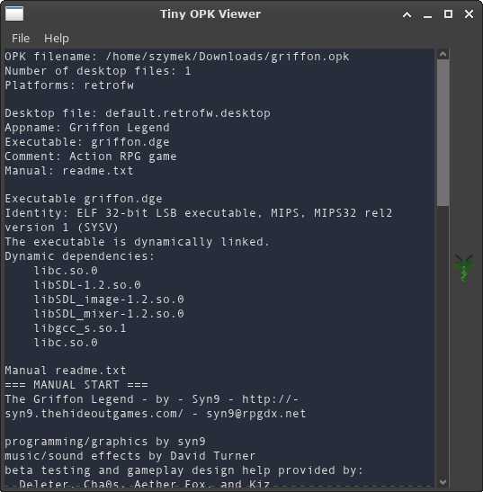

# Tiny OPK Viewer

A simple tool for viewing OpenDingux and RetroFW packages. It supports opening OPKs from both CLI and GUI.

## To Do List
- support for multiple open files (multitab view, cmdline)
- image viewer navigation in case of multiple images in the root directory
- maybe C++ port
